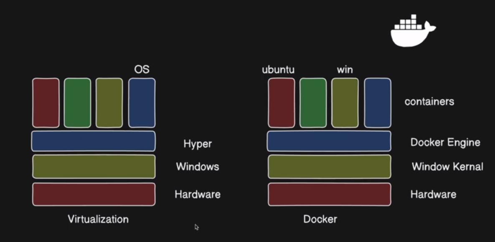

# Docker Architecture

Docker uses a client-server architecture. The Docker client communicates with the Docker daemon, which handles building, running, and distributing Docker containers.

## why docker is light weight

## Docker Architecture Flow

## Key Components

1. **Docker Client**: The primary way users interact with Docker through the CLI
2. **Docker Daemon**: The background service that manages Docker objects
3. **Docker Registry**: Stores Docker images (like Docker Hub)
4. **Docker Objects**: Images, containers, networks, volumes, etc.
